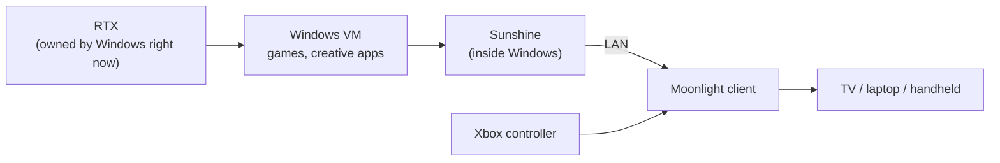
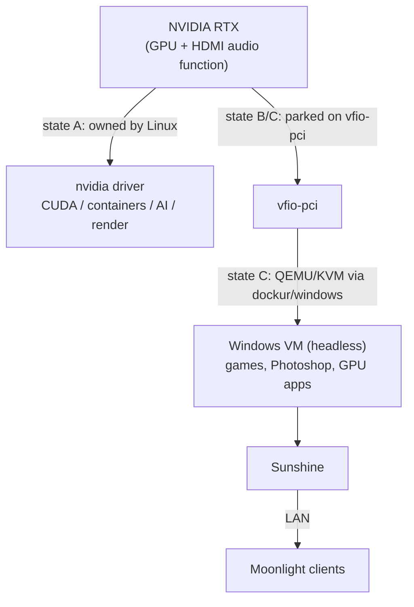
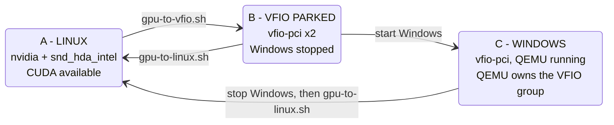

# RTX on Demand

### One RTX in your home server: Linux compute by default, a Windows gaming PC or workstation when someone asks for it.

```text
One powerful GPU.
Linux when you need compute.
Windows when you need a workstation or a gaming PC.
```

Your homelab has a big NVIDIA card. Most of the day it does Linux things: CUDA, local AI, image generation,
inference, transcoding. But sometimes someone at home wants a real, GPU-accelerated Windows: a game, Photoshop, any
Windows application that needs an RTX.

Instead of buying a server with a GPU **plus** a gaming PC **plus** maybe a workstation, this project lets the
**same physical RTX change owner on demand**: Linux gives it to a Windows VM through PCI passthrough, and takes it
back when Windows stops.

> ⚠️ **Advanced homelab project, not one-click.** You will edit kernel parameters, rebind PCI devices as root and
> debug a Windows VM. A wrong step can hang the host until reboot. Read [docs/security.md](docs/security.md) and the
> [warnings](#warnings) first.

## The idea

At any moment the RTX has exactly **one** owner. It is never shared between Linux and Windows at the same time.

```text
   Linux owns the RTX                    Windows owns the RTX
   CUDA, AI, containers                  gaming, Photoshop, GPU apps
          |                                        |
          |   ~/start-windows.sh                   |   ~/stop-windows.sh
          +-------------> VFIO parked ------------>+------------> back to Linux
```

- **Normally:** Linux owns the RTX (NVIDIA driver, CUDA, containers).
- **On demand:** the card is handed to `vfio-pci`, and a Windows VM starts with the real GPU passed through.
- **Afterwards:** Windows shuts down, and the card goes back to the NVIDIA driver, ready for CUDA again.

## Why?

Picture a family with a Linux home server and a big RTX.

- During the day, the RTX serves the server: local AI, image generation, inference, other GPU workloads.
- One evening, someone wants to run Photoshop or another GPU-accelerated Windows application.
- Someone else wants to play *Clair Obscur: Expedition 33* from the sofa, with a controller.
- The kids want to play on the living-room TV, or on another screen in the house.
- Or somebody just needs a powerful Windows workstation for a few hours.

These are examples to convey the idea, not roles. One shared RTX covers all of them, one at a time, with no second
machine to buy, power and maintain.

## How it feels

Once the system is installed, you do not think about VFIO, PCI IDs or IOMMU groups. From your home directory:

```bash
~/windows-status.sh    # who owns the GPU right now? (read-only, never asks for sudo)
```

**Want Windows?**

```bash
~/start-windows.sh     # Linux gives up the RTX, Windows starts with it, prints READY when verified
```

**Done?**

```bash
~/stop-windows.sh      # Windows stops gracefully, the RTX returns to Linux, CUDA is available again
```

Both scripts check the current state first and refuse to continue if something looks wrong.

## Gaming from the living room

The Windows VM has no monitor and does not need one. A virtual display is created inside Windows, and the picture
is streamed over your LAN, so the home server can act as a gaming PC on demand without sitting next to the TV.



[Sunshine](https://github.com/LizardByte/Sunshine) and [Moonlight](https://moonlight-stream.org) are existing
upstream projects. **This repository does not install them for you.** You install Sunshine in the Windows guest and
Moonlight on your clients, following [docs/sunshine.md](docs/sunshine.md) and [docs/moonlight.md](docs/moonlight.md).

Handy during setup: Moonlight's stats overlay and mouse-capture toggle, see
[Moonlight shortcuts](docs/moonlight.md#useful-moonlight-shortcuts).

An Xbox controller connected to the Moonlight client was validated on the reference build (details and caveats in
[docs/gamepad.md](docs/gamepad.md)). A TV box or handheld as the client is plausible but **untested here**: the
reference tests used a laptop client.

## Architecture

The RTX goes either to Linux or to the Windows VM. The two branches below are alternatives over time, not
concurrent users of the card.



Layer details: [docs/architecture.md](docs/architecture.md).

## A typical day

1. **Daytime.** The RTX belongs to Linux and runs GPU workloads: a local model, image generation, batch jobs.
2. **Evening.** Someone wants Windows. `~/start-windows.sh`: Linux releases the card, Windows boots with it.
3. **Windows time.** Photoshop at the desk, or a game streamed to the living-room TV with Moonlight and a controller.
4. **Done.** `~/stop-windows.sh`: Windows shuts down, the RTX goes back to Linux.
5. **Night.** CUDA and the local AI stack have the GPU again.

Plan for Linux GPU jobs to be stopped before Windows is requested: the transition needs the card to be free, and
the guards refuse to proceed rather than pull it from a running process.

## What this project is, and is not

It does **not** invent VFIO, PCI passthrough, Sunshine, Moonlight or Docker-based Windows. It is **not** a new
passthrough technique.

Its value is the assembly of these existing pieces into a reproducible workflow:

```text
Linux GPU  <->  VFIO parked  <->  Windows GPU
```

- auto-discovery of the GPU, its audio function and IOMMU group when possible
- guards before every transition
- explicit state detection (with a read-only status command)
- fail-closed transitions: unknown state means stop and report
- simple user commands
- documentation and recovery paths

## Requirements

- CPU/board/BIOS with working IOMMU and a clean IOMMU group for the GPU
- An NVIDIA GPU you can dedicate to this, KVM, Docker + Compose
- Ubuntu (tested on 24.04), and a Windows ISO you are licensed to use
- A LAN and Moonlight clients (for the streaming scenario)

Full list and caveats: [docs/hardware-requirements.md](docs/hardware-requirements.md).

## Installation

Overview of the steps:

1. [Host setup](docs/host-setup.md): BIOS, kernel parameters, NVIDIA driver, Docker
2. [IOMMU & VFIO](docs/iommu-and-vfio.md): verify groups, understand dynamic binding
3. Run `scripts/status.sh`: the GPU, its audio function and the IOMMU group are auto-detected. No configuration file
   is needed unless detection is ambiguous (e.g. two NVIDIA GPUs). The only value you provide is the path of the
   Windows compose file, until the container exists (see [docs/host-setup.md](docs/host-setup.md); advanced
   overrides: [config/gpu.env.example](config/gpu.env.example))
4. [Windows VM](docs/windows-vm.md) (+ [LTSC notes](docs/windows-ltsc.md)) using
   [examples/docker-compose.yml](examples/docker-compose.yml)
5. [Virtual display](docs/virtual-display.md), [audio](docs/audio.md), [Sunshine](docs/sunshine.md),
   [gamepad](docs/gamepad.md), [Moonlight clients](docs/moonlight.md)
6. Install the three home commands:

```bash
git clone https://github.com/samueldotfr/rtx-on-demand.git
cd rtx-on-demand
./install/install-user-commands.sh      # puts three launchers in your home directory
```

The three commands are thin launchers: each one `exec`s the matching script in the clone
(`scripts/status.sh`, `scripts/start-windows.sh`, `scripts/stop-windows.sh`), forwarding arguments and exit code.
They contain no GPU, Docker or configuration logic. The clone stays the single source of truth: update it with
`git pull`; re-run the installer only if you move it. You can also run the scripts directly from `scripts/`.

The installer never overwrites a file that is not one of its own launchers. With `--force` it first makes a
verified, timestamped backup. `--dest DIR` chooses another directory, and `--dry-run` shows what would happen.

The start and stop scripts re-run themselves with `sudo` when root is needed. `--dry-run` prints the plan and runs
the read-only guards without changing anything. The start script never silently recreates the VM: a running Windows
is left alone, an existing container is started with `docker start`, and the compose file is used only to create a
container that does not exist yet (`--no-recreate`).

## Safety and state machine

There are three explicit states, and a read-only status command reports which one you are in:



- Windows is **never** started before the GPU is available to VFIO.
- The GPU is **never** handed back to Linux while Windows/QEMU still holds it.
- Any other combination is reported as `INCONSISTENT`; the start and stop scripts refuse to act and a human decides.
- Transitions are runtime-only: a host reboot returns the GPU to Linux.

Details: [docs/state-machine.md](docs/state-machine.md) and [docs/gpu-handoff.md](docs/gpu-handoff.md).

## Reference build results

Observed on our reference setup (a mini PC with a Ryzen 7 CPU, RTX 4070 Ti SUPER, Ubuntu 24.04, dockur/windows,
Windows 11 IoT Enterprise LTSC 2024 Evaluation). **Not guarantees; not reproducible on arbitrary hardware.**

| Test | Observed |
|---|---|
| Moonlight (Windows client), AV1, 5120x1440, target 120 fps | ~119.94 fps, ~0.46 ms client decode, ~1 ms LAN in that measurement, very low client frame queue |
| No Man's Sky, native 5120x1440, high/Ultra settings (per our test) | ~85-90 FPS |
| Xbox controller via Moonlight + Sunshine + ViGEmBus 1.22.0 | Worked immediately after install |
| H.264 at 5120x1440 | Failed (NVENC width limit >4096 observed, hangs) |
| HEVC at 5120x1440 | Worked server-side; very slow decode on our particular Intel client |

More in [docs/performance.md](docs/performance.md) and [docs/reference-build.md](docs/reference-build.md).

## Troubleshooting and deeper documentation

[Troubleshooting](docs/troubleshooting.md) · [Known issues](docs/known-issues.md) ·
[Architecture](docs/architecture.md) · [Hardware](docs/hardware-requirements.md) ·
[Host setup](docs/host-setup.md) · [IOMMU & VFIO](docs/iommu-and-vfio.md) ·
[Windows VM](docs/windows-vm.md) · [Windows LTSC](docs/windows-ltsc.md) ·
[Virtual display](docs/virtual-display.md) · [Sunshine](docs/sunshine.md) ·
[Moonlight](docs/moonlight.md) · [Audio](docs/audio.md) · [Gamepad](docs/gamepad.md) ·
[GPU handoff](docs/gpu-handoff.md) · [State machine](docs/state-machine.md) ·
[Performance](docs/performance.md) · [Security](docs/security.md) ·
[Reference build](docs/reference-build.md)

Screenshots are still placeholders, see [assets/README.md](assets/README.md).

## Warnings

- **VFIO risk.** Unbinding a GPU in use can hang or crash the host. The scripts refuse when guards fail, but they
  cannot protect against every driver state. Test on a machine you can power-cycle.
- **Security.** A passed-through Windows VM, Sunshine, RDP, SSH and noVNC are network services holding powerful
  access. LAN only, strong credentials, never internet-exposed. See [docs/security.md](docs/security.md).
- **Licensing.** You need a legitimate Windows license for permanent use. No keys, ISOs or activation workarounds
  are provided here.
- **Anti-cheat.** Some online games block VMs. Not tested here.

## Project status

Early (v0.1). Works on one reference machine. The scripts are in daily use on it (maintainer-reported), and
hardware-free mock tests (`tests/`) pass. The reboot/crash matrix is still incomplete. Untested: Intel hosts, AMD
GPUs, other distros, other gamepads, TV-box clients, multi-GPU hosts. See [docs/known-issues.md](docs/known-issues.md).

## License

MIT, see [LICENSE](LICENSE). Third-party projects (Sunshine, Moonlight, dockur/windows, Virtual Display Driver,
ViGEmBus, NVIDIA components) have their own licenses and are not redistributed here.
