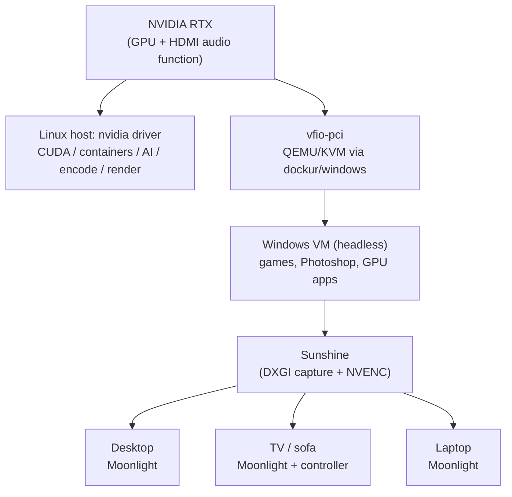
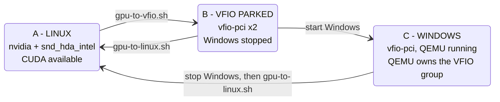

# Homelab GPU Workstation

**One GPU. Whole home.**

Turn one homelab GPU into a shared Linux compute GPU **and** a high-performance Windows
gaming/workstation PC available anywhere in your home.

> **One GPU. Two worlds.**
>
> - **Linux:** CUDA, AI, rendering, GPU containers
> - **Windows:** gaming, creative apps, remote workstation (headless VM)
> - **Streaming:** Sunshine + Moonlight
> - **Input:** keyboard, mouse, Xbox controller

The RTX does not belong to a gaming PC. It belongs to the homelab and is *reassigned on demand*:
when nobody needs Windows, Linux has the GPU; when someone wants Photoshop or a game, the GPU is
handed to a Windows VM, and handed back afterwards.

**What this is, and is not.** It is not a new VFIO technique. It is a reproducible *assembly* of existing,
well-known pieces (VFIO, `driver_override`, dockur/windows, a virtual display, Sunshine/Moonlight) around one idea: the
RTX normally belongs to the Linux server (CUDA, local AI, rendering, transcoding) and is handed to a headless Windows VM
**on demand**, then handed back when Windows stops. The contribution is the guarded handoff, the documented state
machine, and the field notes.

> ⚠️ **This is an advanced homelab / VFIO project. It is not one-click.** You will edit kernel
> parameters, rebind PCI devices as root, and debug a Windows VM. A wrong step can hang the host
> until reboot. Read [docs/security.md](docs/security.md) and the warnings below first.

## Architecture



The GPU is owned by **either** Linux **or** the VM at any moment, never both.

## Scenarios

1. **Work** - start the Windows workstation, open Moonlight, use a GPU-accelerated Windows app.
2. **Desk gaming** - laptop/desktop with Moonlight, streaming from the homelab.
3. **Living-room gaming** - TV or mini-PC running Moonlight + Xbox controller → Sunshine → Windows → game on the RTX.
4. **Back to Linux** - stop Windows; the RTX returns to the NVIDIA driver and CUDA/containers can use it again.

## Features

- Dynamic GPU reassignment with `driver_override` (no `vfio-pci.ids` at boot, GPU stays usable by Linux)
- Guarded, lock-protected, **fail-closed** transition scripts (no blind rollback)
- Three explicit states with a read-only `status.sh`
- Headless Windows with a Virtual Display Driver (a reference build ran 5120x1440 @ 120 Hz)
- Headless audio via an emulated Intel HDA codec so Sunshine always has something to capture
- Keyboard, mouse and Xbox gamepad over Moonlight
- Sanitized, generic Compose example ([examples/](examples/))

## State machine



Windows must **never** be started before the GPU is available to VFIO, and the GPU must **never**
be handed back to Linux while Windows/QEMU still holds it. Details: [docs/state-machine.md](docs/state-machine.md).

## Usage (once installed)

```bash
scripts/start-windows.sh    # Linux -> VFIO if needed, start Windows, verify, print READY
scripts/status.sh           # read-only, never asks for sudo
scripts/stop-windows.sh     # graceful stop, wait QEMU + VFIO, VFIO -> NVIDIA, verify
```

The start/stop scripts re-run themselves with `sudo` when root is needed. `--dry-run` prints the plan
and runs read-only guards without changing anything. Optional launchers in your home directory:
`install/install-user-commands.sh` installs `~/start-windows.sh`, `~/stop-windows.sh` and
`~/windows-status.sh`; they just `exec` the scripts of the clone you installed them from.

The start script never silently recreates the VM: a running Windows is left alone, an existing
container is started with `docker start`, and the compose file is used only to create a container
that does not exist yet (`--no-recreate`).

## Requirements (summary)

- CPU/board/BIOS with working IOMMU and a clean IOMMU group for the GPU
- An NVIDIA GPU you can dedicate to this, KVM, Docker + Compose
- Ubuntu (tested 24.04), a Windows ISO you are licensed to use
- A LAN and Moonlight clients

Full list and caveats: [docs/hardware-requirements.md](docs/hardware-requirements.md).

## Installation overview

1. [Host setup](docs/host-setup.md): BIOS, kernel parameters, NVIDIA driver, Docker
2. [IOMMU & VFIO](docs/iommu-and-vfio.md): verify groups, understand dynamic binding
3. Run `scripts/status.sh`: the GPU, its audio function and the IOMMU group are auto-detected.
   No configuration file is needed unless detection is ambiguous (e.g. two NVIDIA GPUs). The only
   value you provide is the path of the Windows compose file, until the container exists
   (see [docs/host-setup.md](docs/host-setup.md); advanced overrides: [config/gpu.env.example](config/gpu.env.example))
4. [Windows VM](docs/windows-vm.md) (+ [LTSC notes](docs/windows-ltsc.md)) using [examples/docker-compose.yml](examples/docker-compose.yml)
5. [Virtual display](docs/virtual-display.md), [audio](docs/audio.md), [Sunshine](docs/sunshine.md), [gamepad](docs/gamepad.md)
6. [Moonlight clients](docs/moonlight.md)

## Reference build results

Observed on our reference setup (GMKtec NucBox K12, Ryzen 7 H 255, RTX 4070 Ti SUPER, Ubuntu 24.04,
dockur/windows, Windows 11 IoT Enterprise LTSC 2024 Evaluation). **Not guarantees; not reproducible
on arbitrary hardware.**

| Test | Observed |
|---|---|
| Moonlight (Windows client), AV1, 5120x1440, target 120 fps | ~119.94 fps, ~0.46 ms client decode, ~1 ms LAN in that measurement, very low client frame queue |
| No Man's Sky, native 5120x1440, high/Ultra settings (per our test) | ~85-90 FPS |
| Xbox controller via Moonlight + Sunshine + ViGEmBus 1.22.0 | Worked immediately after install |
| H.264 at 5120x1440 | Failed (NVENC width limit >4096 observed, hangs) |
| HEVC at 5120x1440 | Worked server-side; very slow decode on our particular Intel client |

More in [docs/performance.md](docs/performance.md) and [docs/reference-build.md](docs/reference-build.md).

## Screenshots

*Placeholders, see [assets/README.md](assets/README.md).*

| Moonlight stats overlay | Sunshine dashboard | Remote joy.cpl |
|---|---|---|
| _coming soon_ | _coming soon_ | _coming soon_ |

## Documentation

[Architecture](docs/architecture.md) · [Hardware](docs/hardware-requirements.md) ·
[Host setup](docs/host-setup.md) · [IOMMU & VFIO](docs/iommu-and-vfio.md) ·
[Windows VM](docs/windows-vm.md) · [Windows LTSC](docs/windows-ltsc.md) ·
[Virtual display](docs/virtual-display.md) · [Sunshine](docs/sunshine.md) ·
[Moonlight](docs/moonlight.md) · [Audio](docs/audio.md) · [Gamepad](docs/gamepad.md) ·
[GPU handoff](docs/gpu-handoff.md) · [State machine](docs/state-machine.md) ·
[Performance](docs/performance.md) · [Security](docs/security.md) ·
[Troubleshooting](docs/troubleshooting.md) · [Known issues](docs/known-issues.md) ·
[Reference build](docs/reference-build.md)

## Warnings

- **VFIO risk.** Unbinding a GPU in use can hang or crash the host. The scripts refuse when guards
  fail, but they cannot protect against every driver state. Test on a machine you can power-cycle.
- **Not persistent.** Transitions are runtime-only; a host reboot returns the GPU to Linux.
- **Security.** A passed-through Windows VM, Sunshine, RDP, SSH and noVNC are network services
  holding powerful access. LAN only, strong credentials, never internet-exposed. See [docs/security.md](docs/security.md).
- **Licensing.** You need a legitimate Windows license for permanent use. No keys, ISOs or
  activation workarounds are provided here.
- **Anti-cheat.** Some online games block VMs. Not tested here.

## Project status

Early (v0.1). Works on one reference machine. Static and mock tests (`tests/`, no hardware needed) pass; the repo scripts have not yet been validated end-to-end on real hardware. Untested: Intel hosts, AMD GPUs, other distros,
other gamepads, reboot/crash matrix, multi-GPU hosts. See [docs/known-issues.md](docs/known-issues.md).

## License

MIT, see [LICENSE](LICENSE). Third-party projects (Sunshine, Moonlight, dockur/windows, Virtual
Display Driver, ViGEmBus, NVIDIA components) have their own licenses and are not redistributed here.
