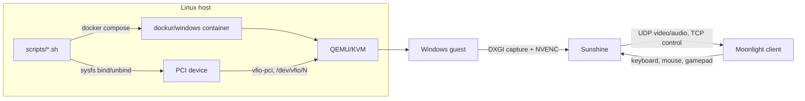

# Architecture

## Components and who owns what

| Layer | Component | Scope |
|---|---|---|
| Hardware | GPU + its HDMI/DP audio function | Generic (PCI) |
| Host kernel | IOMMU, `vfio-pci`, KVM | Generic Linux |
| Host driver | `nvidia` (open kernel modules in our build), `snd_hda_intel` | **NVIDIA-specific** |
| Host userspace | NVIDIA Container Toolkit, CDI, `nvidia-persistenced` | **NVIDIA-specific** |
| VM runtime | `dockurr/windows` (QEMU/KVM in Docker) | **Dockur-specific** |
| Host OS | Ubuntu 24.04 | **Ubuntu-specific** (commands, package names) |
| Guest | Windows 11, Virtual Display Driver, Sunshine, ViGEmBus | Windows-specific |
| Clients | Moonlight on Windows/Linux/TV | Generic |
| Reference machine | PCI addresses, IOMMU group number, 5120x1440 mode, RAM/CPU sizing | **Reference-build only**, parameterized via `config/gpu.env` |

## Data paths

- **Video:** GPU renders into a *virtual* monitor (Virtual Display Driver). Sunshine captures it
  (DXGI), encodes with NVENC, sends over RTP-like UDP. The client decodes and displays.
- **Audio:** QEMU provides an emulated HDA codec; Windows gets a "Speakers" endpoint; Sunshine
  captures it. See [audio.md](audio.md).
- **Input:** Moonlight → Sunshine → Windows input injection; gamepads through a virtual controller
  driver. See [gamepad.md](gamepad.md).
- **Control plane:** shell scripts on the host decide who owns the GPU. Nothing inside Windows
  participates in the handoff except shutting down cleanly.

## Design choices

- **Dynamic binding over boot-time binding.** The GPU stays under `nvidia` until Windows is wanted.
  Alternative (not used here): `vfio-pci.ids=` on the kernel command line, which makes the GPU
  VFIO-only until reconfigured. See [iommu-and-vfio.md](iommu-and-vfio.md).
- **Headless.** No monitor attached; the display is virtual.
- **Fail closed.** Unknown state → stop and report.
- **Scripts instead of a daemon.** Simple and auditable in v0.1.
