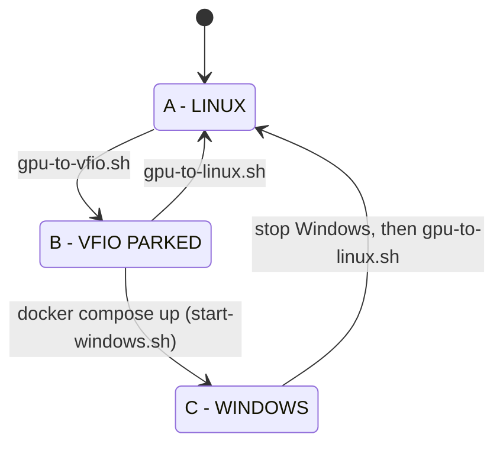

# State machine

## State A - LINUX

| Item | Value |
|---|---|
| GPU function | `nvidia` |
| Audio function | `snd_hda_intel` |
| Windows | stopped |
| CUDA | available |

## State B - VFIO PARKED

| Item | Value |
|---|---|
| GPU function | `vfio-pci` |
| Audio function | `vfio-pci` |
| `/dev/vfio/<group>` | present, not held |
| Windows | stopped |

## State C - WINDOWS

| Item | Value |
|---|---|
| Both functions | `vfio-pci` |
| Windows container + QEMU | running; QEMU holds the VFIO group |

## Transitions

| Transition | Meaning | Script |
|---|---|---|
| A → B | Linux releases GPU, vfio-pci claims it | `gpu-to-vfio.sh` |
| B → C | Windows/QEMU starts | `start-windows.sh` |
| C → A | Windows stops, VFIO released, NVIDIA drivers reclaim GPU | `stop-windows.sh` |
| B → A | VFIO released, NVIDIA drivers reclaim GPU | `gpu-to-linux.sh` |

**Rules:** never start Windows before the GPU is on VFIO; never return the GPU while Windows/QEMU holds it.

## INCONSISTENT

Anything else is reported by `status.sh` as `INCONSISTENT` with a reason (e.g. one function on `nvidia`, the other on `vfio-pci`;
Windows running while the GPU is on Linux drivers; QEMU running without the container; `/dev/vfio/<group>` held by an unknown process).
`start-windows.sh` and `stop-windows.sh` **refuse to act** in that state (fail closed). A human decides. No script tries to repair.

Detection logic: `detect_state` in [scripts/lib/common.sh](../scripts/lib/common.sh).
